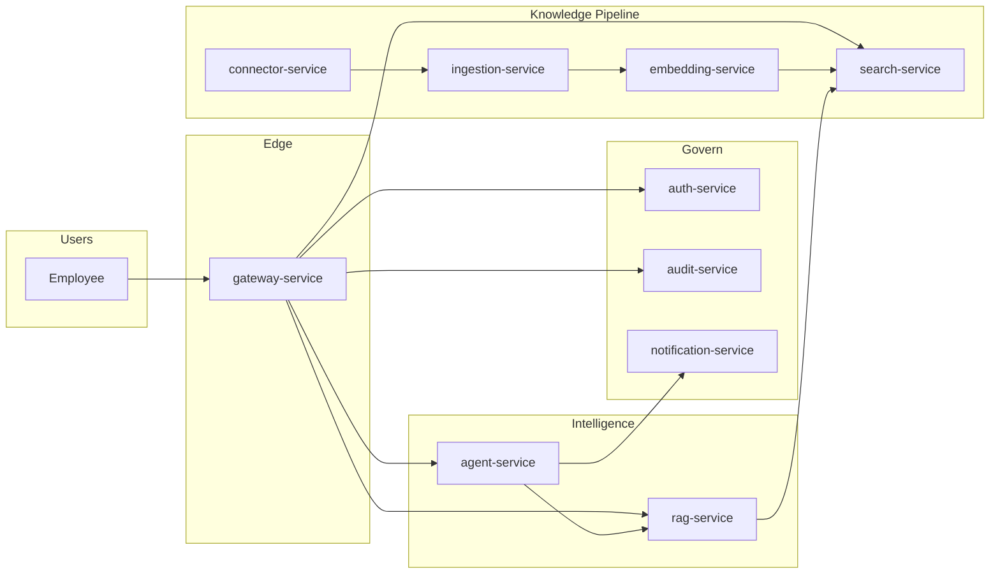
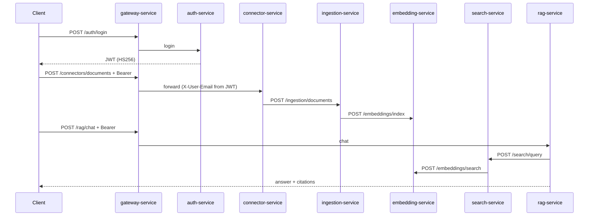
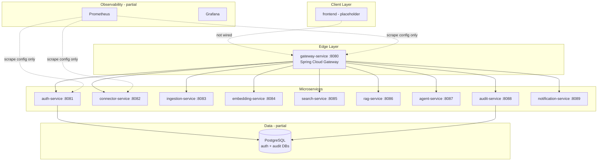
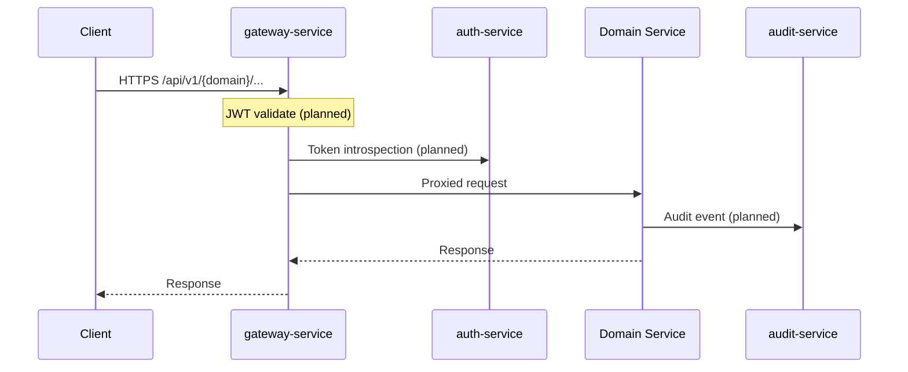
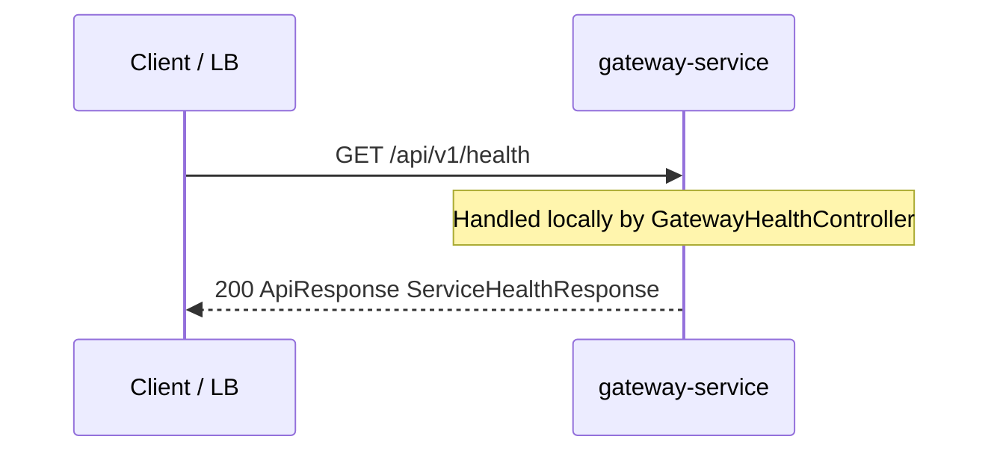
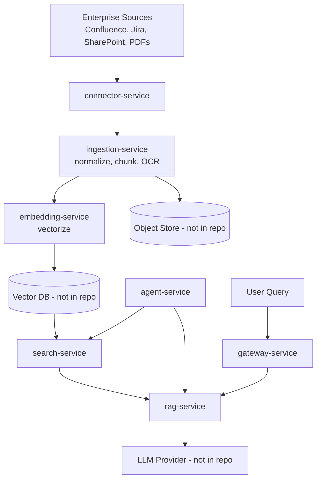
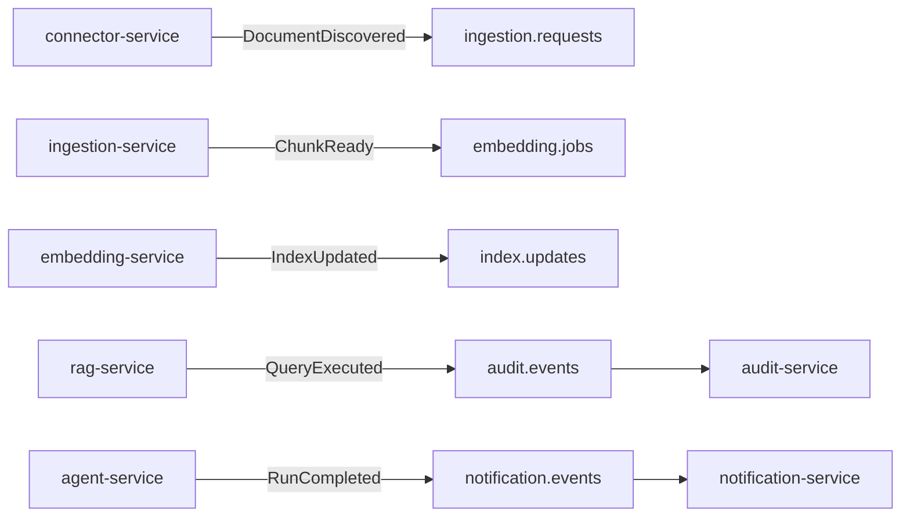
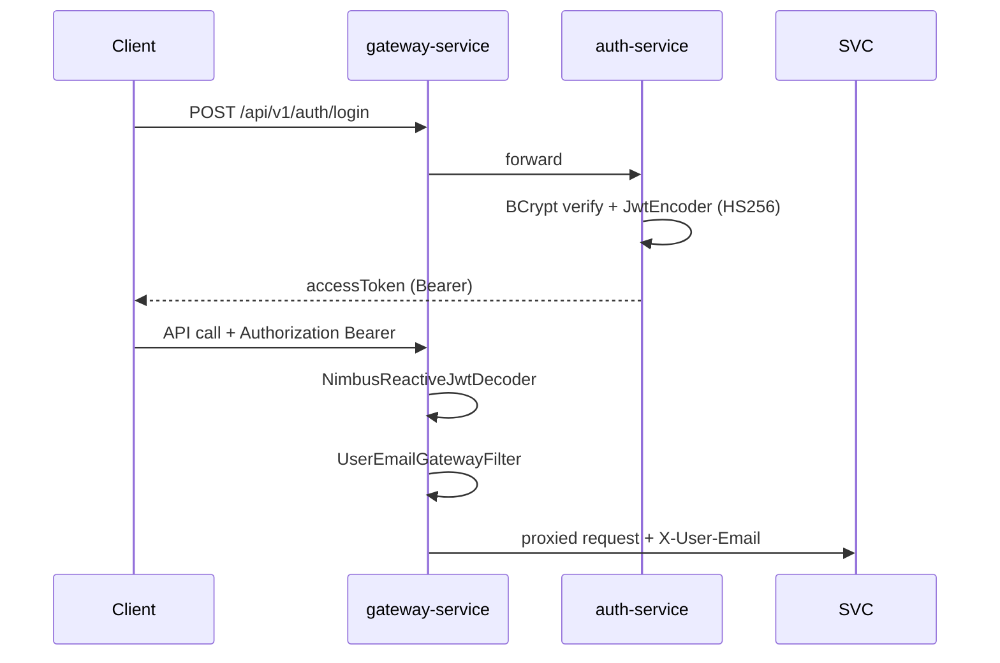
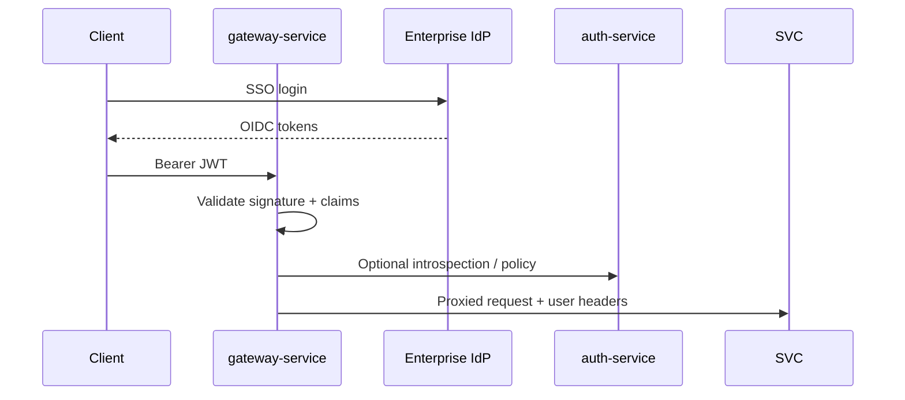

# System Architecture Analysis — Enterprise AI Platform

> **Document status:** Updated for Phase 1 MVP — `0.0.1-SNAPSHOT`  
> **Maturity level:** **Phase 1 — MVP vertical slice** (JWT auth, manual connector, ingestion/chunking, embedding index, semantic search, RAG chat). Agent, audit, OIDC, Kafka, and production hardening remain **planned**.  
> **Analyzer role:** Original architect, staff engineer, principal engineer, tech lead, production support engineer, and interviewer perspective combined.  
> **Quick start:** [`docs/MVP_RUNBOOK.md`](docs/MVP_RUNBOOK.md) · **Overview:** [`docs/ARCHITECTURE.md`](docs/ARCHITECTURE.md)

---

## Table of Contents

1. [Executive Summary](#executive-summary)
2. [High-Level Architecture](#high-level-architecture)
3. [Repository Structure Analysis](#repository-structure-analysis)
4. [Service Analysis](#service-analysis)
5. [API Analysis](#api-analysis)
6. [Database Analysis](#database-analysis)
7. [Event & Messaging Analysis](#event--messaging-analysis)
8. [Security Analysis](#security-analysis)
9. [Caching Analysis](#caching-analysis)
10. [Infrastructure Analysis](#infrastructure-analysis)
11. [Observability Analysis](#observability-analysis)
12. [Scalability Review](#scalability-review)
13. [Production Failure Analysis](#production-failure-analysis)
14. [Technical Debt Assessment](#technical-debt-assessment)
15. [Interview Preparation Guide](#interview-preparation-guide)
16. [Architecture Critique](#architecture-critique)
17. [Learning Notes](#learning-notes)
18. [Appendix: Class & Component Inventory](#appendix-class--component-inventory)

---

# Executive Summary

## What is this system?

The **Enterprise AI Platform** (`com.enterprise.ai:enterprise-ai-platform`) is a **cloud-native, microservices-oriented platform** designed to let enterprise employees **securely search, chat with, and automate work** across organizational knowledge—Confluence, Jira, SharePoint, PDFs, incident reports, and internal documentation—using **Retrieval-Augmented Generation (RAG)**, **AI agents**, and **workflow automation**.

**Today**, the repository implements a **working MVP vertical slice** on top of the microservices scaffold: employees can **log in (JWT)**, **upload text documents** via a manual connector, **ingest and chunk** content, **index embeddings**, **search semantically**, and **chat with RAG** (stub LLM or OpenAI). **Agents, enterprise OIDC, multi-source connectors (Confluence/Jira), Kafka, and audit logging** are still planned.

## Business purpose

| Driver | How the platform addresses it (intended) |
|--------|------------------------------------------|
| Knowledge fragmentation | Unified search and Q&A across many systems |
| Unsafe ad-hoc LLM use | Central gateway, auth, audit, policy enforcement |
| Manual repetitive work | Agent workflows with enterprise tool integrations |
| Compliance | Immutable audit trail, access control on sources |
| Time-to-answer | RAG with grounded citations from internal docs |

## Main users

| Persona | Primary interactions (intended) |
|---------|-----------------------------------|
| **Employee / knowledge worker** | Search, chat, agent tasks via `frontend/` |
| **Platform admin** | Connector config, ingestion jobs, model settings |
| **Security / compliance** | Audit queries, access reviews |
| **SRE / platform engineering** | Deployments, observability, incident response |

## Core workflows (intended end-state)



**Implemented today (MVP):**

| Capability | Status |
|------------|--------|
| JWT login / register | ✅ `auth-service` + gateway validation |
| Manual document upload | ✅ `POST /api/v1/connectors/documents` |
| Ingestion + chunking | ✅ `ingestion-service` → Flyway `documents`, `document_chunks` |
| Embedding index | ✅ `embedding-service` → `chunk_embeddings` (dev hash vectors; 384-dim) |
| Semantic search | ✅ `POST /api/v1/search/query` |
| RAG chat + citations | ✅ `POST /api/v1/rag/chat` (stub or `OPENAI_API_KEY`) |
| Health + gateway routes | ✅ All services |
| Agents, audit events, Kafka | ⬜ Scaffold only |

---

# Phase 1 MVP — Implemented Capabilities

## End-to-end sequence



## Shared DTOs (`platform-common`)

| Record | Purpose |
|--------|---------|
| `DocumentUploadRequest` | Connector upload body |
| `DocumentIngestionResponse` | `documentId`, `chunkCount`, `status` |
| `ChunkIndexRequest` | Batch chunk payload for embedding |
| `SearchRequest` / `SearchResponse` / `SearchHit` | Retrieval |
| `ChatRequest` / `ChatResponse` / `Citation` | RAG |
| `AuthLoginRequest` / `AuthRegisterRequest` / `AuthTokenResponse` | Auth |

## Inter-service communication (MVP)

Synchronous **REST** via `WebClient` (no message broker):

| From | To | Call |
|------|-----|------|
| connector-service | ingestion-service | `POST /api/v1/ingestion/documents` |
| ingestion-service | embedding-service | `POST /api/v1/embeddings/index` |
| search-service | embedding-service | `POST /api/v1/embeddings/search` |
| rag-service | search-service | `POST /api/v1/search/query` |

## MVP limitations (explicit)

- Embeddings are **deterministic hash-based vectors** (dev only), not OpenAI/pgvector.
- LLM is **stub** unless `OPENAI_API_KEY` is set on `rag-service`.
- **No** document ACL, tenant isolation, or audit trail on queries.
- **No** service-to-service JWT; internal ports trusted on localhost.
- **No** OIDC — custom JWT from `auth-service` only.

---

# High-Level Architecture

## Architectural style

| Decision | Choice in repo | Why (design intent) |
|----------|----------------|---------------------|
| Decomposition | **Microservices by domain** (connect, ingest, embed, search, RAG, agent, govern) | Independent scaling, team ownership, blast-radius isolation |
| Monorepo | **Maven multi-module** | Shared types (`platform-common`), consistent versions, atomic refactors |
| Edge | **Spring Cloud Gateway** (WebFlux/Netty) | Non-blocking edge, path-based routing, future filters (auth, rate limit) |
| Services | **Spring Boot 3.4.5** servlet stack (except gateway) | Enterprise-standard stack, rich ecosystem |
| Language runtime | **Java 17** | LTS alignment with corporate JDK policies |
| Data | **PostgreSQL** — auth, ingestion, embedding DBs (Flyway) | Per-service schemas; audit DB provisioned but empty |
| Inter-service sync | **WebClient** REST (MVP) | Simple; migrate to Kafka for scale |
| Async (planned) | Not present in code | Would decouple ingestion/embed indexing from API latency |

**Rejected alternatives (typical reasoning for this shape):**

| Alternative | Why not chosen (for this system) |
|-------------|----------------------------------|
| Single modular monolith | Harder to scale ingestion vs. API independently; noisy deploys |
| Serverless-only | Long-running ingestion/agent jobs, VPC connectors to SharePoint/Jira fit containers better |
| GraphQL-only BFF | Enterprise clients often need REST + gateway policies; BFF can be added later |
| Per-service DB from day one | Scaffold uses two DBs; others will add vector store / object storage when implemented |

## Architecture diagram (as-designed vs. as-built)



Solid lines = routing/config exists. Dotted = placeholder or not implemented.

## Service interactions (request flow)

### External API request (intended)



### Health check (implemented)



Per-service health bypasses gateway unless routed; each service also exposes `GET /api/v1/health` on its own port.

## Data flow (intended knowledge pipeline)



**Why pipeline split:** Ingestion and embedding are **throughput-heavy and bursty**; search/RAG are **latency-sensitive**. Separating services allows scaling embedding workers without scaling chat API replicas.

---

# Repository Structure Analysis

## Root (`enterprise-ai-platform/`)

| Aspect | Detail |
|--------|--------|
| **Purpose** | Maven aggregator POM; BOM for Spring Cloud; module orchestration |
| **Responsibilities** | Version alignment (`Spring Boot 3.4.5`, `Spring Cloud 2024.0.1`), `dependencyManagement` for `platform-common` |
| **Dependencies** | `spring-boot-starter-parent`, imported `spring-cloud-dependencies` |
| **Why it exists** | Single place to bump platform-wide versions; CI runs `mvn clean install` once |

**Key file:** `pom.xml` — `packaging=pom`, 12 modules listed.

---

## `platform-common/`

| Aspect | Detail |
|--------|--------|
| **Purpose** | Shared JVM library (not deployable) |
| **Responsibilities** | API envelope, service registry enum, constants |
| **Dependencies** | `spring-boot-starter-validation`, Lombok |
| **Why it exists** | Avoid duplicating `/api/v1` prefix and response shape across 10 services; future home for error codes, DTOs, tracing helpers |

**Classes:**

| Class | Role |
|-------|------|
| `PlatformConstants` | `API_PREFIX = "/api/v1"` |
| `PlatformService` | Enum of service names + default ports |
| `ApiResponse<T>` | Standard wrapper: `data` + `timestamp` |
| `ServiceHealthResponse` | Health payload: `status`, `service` |

---

## `platform-service-parent/`

| Aspect | Detail |
|--------|--------|
| **Purpose** | Intermediate Maven POM (`packaging=pom`) — dependency template |
| **Responsibilities** | Pulls in web, validation, actuator, test, Lombok, `platform-common`; configures `spring-boot-maven-plugin` |
| **Dependencies** | Inherited by 9 servlet microservices |
| **Why it exists** | DRY for identical starter sets; gateway intentionally **does not** inherit (reactive stack) |

**Design note:** Child services use `<relativePath>../platform-service-parent/pom.xml</relativePath>` because Maven’s default `../pom.xml` would incorrectly resolve to the root aggregator.

---

## `gateway-service/`

| Aspect | Detail |
|--------|--------|
| **Purpose** | North-south traffic entry, path-based routing |
| **Responsibilities** | Route `/api/v1/{domain}/**` to backend ports; local health endpoint |
| **Dependencies** | `spring-cloud-starter-gateway`, `platform-common`, actuator |
| **Why it exists** | Single public URL, central TLS termination, rate limits, auth filters later |

**Stack difference:** Netty/WebFlux — not servlet — so it does not use `platform-service-parent`.

---

## `auth-service/`

| Aspect | Detail |
|--------|--------|
| **Purpose** | Identity, authentication, authorization (intended) |
| **Responsibilities** | Today: Spring Security filter chain stub; JPA + Postgres configured |
| **Dependencies** | + `spring-boot-starter-security`, `data-jpa`, PostgreSQL, H2 (test) |
| **Why separate service** | Security-critical boundary; shortest path to SSO/OIDC without redeploying RAG |

---

## `connector-service/`

| Aspect | Detail |
|--------|--------|
| **Purpose** | Integrations with external enterprise systems |
| **Responsibilities** | Intended: OAuth to Confluence/Jira/SharePoint, webhooks, crawl triggers |
| **Dependencies** | Standard web stack only (today) |
| **Why it exists** | Isolates third-party API volatility and credential scopes |

---

## `ingestion-service/`

| Aspect | Detail |
|--------|--------|
| **Purpose** | Document ingestion pipeline orchestration |
| **Responsibilities** | Intended: parse PDF/HTML, chunking, metadata extraction, enqueue embed jobs |
| **Why it exists** | CPU/IO heavy; should not run in request thread of search API |

---

## `embedding-service/`

| Aspect | Detail |
|--------|--------|
| **Purpose** | Vector embedding generation |
| **Responsibilities** | Intended: batch embed, model selection, write to vector index |
| **Why it exists** | GPU/batch workloads scale differently from REST CRUD |

---

## `search-service/`

| Aspect | Detail |
|--------|--------|
| **Purpose** | Hybrid retrieval (keyword + vector) |
| **Responsibilities** | Intended: query understanding, ACL filtering, reranking |
| **Why it exists** | Sub-100ms retrieval path separate from LLM orchestration |

---

## `rag-service/`

| Aspect | Detail |
|--------|--------|
| **Purpose** | RAG orchestration (retrieve → prompt → LLM → cite) |
| **Responsibilities** | Intended: context assembly, citation enforcement, model routing |
| **Why it exists** | Highest business value API; isolate prompt logic and LLM spend controls |

---

## `agent-service/`

| Aspect | Detail |
|--------|--------|
| **Purpose** | Multi-step agent workflows and tool use |
| **Responsibilities** | Intended: planner, tool registry (Jira ticket, email), human-in-the-loop |
| **Why it exists** | Agents are stateful, long-running, failure-prone — isolate from stateless RAG |

---

## `audit-service/`

| Aspect | Detail |
|--------|--------|
| **Purpose** | Compliance and security audit log |
| **Responsibilities** | Intended: append-only events (who queried what, which docs retrieved) |
| **Dependencies** | JPA + Postgres (today, no schema) |
| **Why it exists** | Immutable audit must not share DB with auth user tables; simplifies retention policies |

---

## `notification-service/`

| Aspect | Detail |
|--------|--------|
| **Purpose** | Email, Slack, in-app notifications |
| **Responsibilities** | Intended: async delivery, templates, digests |
| **Why it exists** | Decouple side effects from agent/RAG critical path |

---

## `frontend/`

| Aspect | Detail |
|--------|--------|
| **Purpose** | Employee-facing UI |
| **Status** | `package.json` placeholder only — no React/Next app |
| **Why it exists** | BFF/UI concerns separated from backend deploy cadence |

---

## `observability/`

| Aspect | Detail |
|--------|--------|
| **Purpose** | Local metrics stack |
| **Contents** | `docker-compose.yml` (Prometheus + Grafana), `prometheus.yml` static scrape targets |
| **Gap** | No Loki/Tempo/Jaeger; Prometheus endpoint not enabled in service POMs |

---

## `infra/`

| Aspect | Detail |
|--------|--------|
| **Purpose** | Local/dev infrastructure |
| **Contents** | Postgres 16 compose; `init-databases.sql` creates auth, audit, ingestion, embedding DBs |
| **Gap** | No Kubernetes, Helm, Terraform, or CI pipelines in repo |

---

## `docs/`

| Aspect | Detail |
|--------|--------|
| **Purpose** | Human-readable architecture summary |
| **Contents** | `ARCHITECTURE.md`, `MVP_RUNBOOK.md`; root `SYSTEM_ARCHITECTURE_ANALYSIS.md` |

---

# Service Analysis

> **Legend:** ✅ Implemented | 🟡 Configured only | ⬜ Planned

## Summary matrix

| Service | Port | Stack | DB | Security | Business APIs |
|---------|------|-------|-----|----------|---------------|
| gateway-service | 8080 | WebFlux Gateway | — | ✅ JWT validation | ✅ Routes + health |
| auth-service | 8081 | Servlet | ✅ Postgres + Flyway | ✅ Login/register public | ✅ JWT issuance |
| connector-service | 8082 | Servlet + WebClient | — | Via gateway JWT | ✅ Manual document upload |
| ingestion-service | 8083 | Servlet + WebClient | ✅ Postgres + Flyway | Internal (dev) | ✅ Ingest + chunk |
| embedding-service | 8084 | Servlet | ✅ Postgres + Flyway | Internal (dev) | ✅ Index + search |
| search-service | 8085 | Servlet + WebClient | — | Via gateway JWT | ✅ Semantic query |
| rag-service | 8086 | Servlet + WebClient | — | Via gateway JWT | ✅ Chat + citations |
| agent-service | 8087 | Servlet | — | ⬜ | Health only |
| audit-service | 8088 | Servlet | 🟡 Postgres empty | ⬜ | Health only |
| notification-service | 8089 | Servlet | — | ⬜ | Health only |

---

## gateway-service

### Business responsibility (intended)

Single front door for all platform APIs; enforce authn/z, rate limits, request logging, route to correct domain service.

### Technical responsibility (current)

- Spring Cloud Gateway route table in `application.yml` (9 routes, `localhost` URIs).
- **JWT resource server** (`GatewaySecurityConfig`) — protects all routes except `/auth/**` and health.
- `UserEmailGatewayFilter` — propagates `email` claim as `X-User-Email`.
- `GatewayHealthController` — local health not proxied.
- Actuator: `health`, `info`, `metrics` exposed.

### Dependencies

- `platform-common`, `spring-cloud-starter-gateway`, actuator.
- **Does not** depend on `platform-service-parent` (avoids servlet stack conflict).

### Design decisions

| Decision | Rationale |
|----------|-----------|
| Path-based routing (`/api/v1/auth/**`, etc.) | Clear domain ownership; easy to reason about in interviews |
| Static `localhost` URIs | Dev ergonomics; production would use K8s DNS / service discovery |
| Reactive gateway | Higher concurrency for long-lived SSE/chat connections (future) |

### Scalability considerations

- Gateway is **stateless** — horizontal scale behind LB is straightforward.
- Risk: **single point of configuration** — route table must stay in sync with service deployments.
- Future: Redis rate limiter, JWT validation filter, circuit breakers (Resilience4j).

### Failure scenarios

| Failure | Current behavior | Target behavior |
|---------|------------------|-----------------|
| Backend down | 503 from gateway | Retry + circuit breaker + friendly error |
| Gateway pod crash | LB routes to other replicas | K8s readiness probes |
| Misconfigured route | 404 | CI contract tests on route map |

---

## auth-service

### Business responsibility (intended)

Enterprise SSO integration, JWT issuance, RBAC/ABAC on documents and tools, API keys for connectors.

### Technical responsibility (current)

- `AuthController`: `POST /login`, `POST /register` → `AuthTokenResponse` (JWT).
- `JwtTokenService` + `NimbusJwtEncoder` (HS256); claims: `sub`, `email`, `name`.
- `User` entity + Flyway `V1__users.sql`; BCrypt passwords.
- `DevUserInitializer` seeds admin user (non-test profiles).
- `SecurityConfig`: public `/auth/**` and health; no HTTP Basic.

### Dependencies

- `platform-service-parent` + Security + JPA + PostgreSQL.

### Design decisions

| Decision | Rationale |
|----------|-----------|
| Separate auth DB (`enterprise_ai_auth`) | Blast radius; independent backup/rotation |
| `ddl-auto: validate` | Production-safe; Flyway/Liquibase expected next |
| Stateless sessions | Microservice-friendly; tokens not server-sticky |

### Scalability considerations

- Auth is **read-heavy** (token validation) — cache JWKS, use local JWT verify at gateway.
- Write path (login) lower QPS — still needs connection pooling (Hikari default).

### Failure scenarios

| Failure | Impact |
|---------|--------|
| Postgres down | Service fails startup (validate mode); no fallback |
| No UserDetailsService bean | Spring generates **random dev password** at startup (logged) — **not production-safe** |

---

## connector-service

### Business responsibility (intended)

OAuth apps per source, incremental sync, webhook receivers, credential vault integration.

### Technical responsibility (current)

- `ManualDocumentConnectorController`: `POST /api/v1/connectors/documents`.
- `IngestionClient` (WebClient) forwards to ingestion with `X-User-Email`.
- Defaults `sourceType` to `manual` if omitted.

### Dependencies

Standard servlet parent + `spring-boot-starter-webflux` for WebClient.

### Design decisions (recommended)

- Store refresh tokens encrypted; never log document bodies.
- Rate limit per upstream API (Confluence/Jira throttles).
- Idempotent sync jobs keyed by `(source, external_id, version)`.

### Scalability

- Horizontally scale workers; **leader election** for scheduled full syncs.
- Backpressure when ingestion queue depth exceeds threshold.

### Failure scenarios

Upstream API 429/5xx → retry with exponential backoff; dead-letter failed pages for manual replay.

---

## ingestion-service

### Business responsibility (intended)

Normalize formats, chunk text, extract metadata (title, ACL, department), publish embed jobs.

### Technical responsibility (current)

- `DocumentController`: `POST /api/v1/ingestion/documents`.
- `TextChunker`: 800-char chunks, 100-char overlap.
- `DocumentIngestionService`: persists `documents` + `document_chunks`, calls `EmbeddingClient.indexChunks`.
- Flyway schema; Postgres `enterprise_ai_ingestion`.

### Design decisions (recommended)

- **Content-addressable storage** (hash as key) for deduplication.
- Chunk size tuned per embedding model (e.g. 512–1024 tokens).
- Preserve ACL metadata on every chunk for search-time filtering.

### Scalability

- Async pipeline via queue (not in repo); scale consumers independently.
- Large PDFs streamed — avoid loading full file in memory.

### Failure scenarios

Poison document (malformed PDF) → skip chunk, audit error, continue batch.

---

## embedding-service

### Business responsibility (intended)

Call embedding models (open or hosted), batch writes to vector DB, re-embed on model upgrade.

### Technical responsibility (current)

- `EmbeddingController`: `POST /index`, `POST /search`.
- `EmbeddingMath`: 384-dim **hash-based dev embeddings** + cosine similarity.
- `ChunkEmbedding` JPA entity; vectors stored as JSON in `embedding_json`.

### Design decisions (recommended)

- Version embeddings (`model_id`, `dim`) in index metadata.
- Batch API calls to reduce cost.
- GPU nodes optional — Kubernetes node pools with taints.

### Scalability

Primary bottleneck: **model throughput** and **vector index write rate**.

### Failure scenarios

Partial batch failure → transactional retry per batch id; never silent half-indexed corpus.

---

## search-service

### Business responsibility (intended)

Hybrid search, ACL filter, faceting, “people also viewed” (optional).

### Technical responsibility (current)

- `SearchController`: `POST /api/v1/search/query` → delegates to `EmbeddingSearchClient`.

### Design decisions (recommended)

- **Pre-filter by ACL** before vector search (security over recall).
- Combine BM25 + dense retrieval + cross-encoder rerank for enterprise accuracy.

### Scalability

- Shard vector index by tenant or source system.
- Cache hot queries with short TTL + tenant-scoped keys.

### Failure scenarios

Vector DB slow → degrade to keyword-only with warning header.

---

## rag-service

### Business responsibility (intended)

Orchestrate retrieval + LLM + citations; enforce “answer only from context” policies.

### Technical responsibility (current)

- `RagChatController`: `POST /api/v1/rag/chat`.
- `RagChatService`: search → `LlmAnswerService` (OpenAI if `OPENAI_API_KEY`, else stub with citations).

### Design decisions (recommended)

- **Citation-required** prompts for compliance.
- Token budget management (trim context by relevance score).
- Model gateway for cost caps and PII redaction pre-flight.

### Scalability

- Dominant cost: **LLM tokens** — cache retrieved contexts for identical queries cautiously (privacy).
- SSE streaming for UX; gateway timeout tuning.

### Failure scenarios

LLM timeout → return retrieved snippets without generation; audit partial failure.

---

## agent-service

### Business responsibility (intended)

Multi-step plans, tool invocation (Jira create, Confluence update), human approval gates.

### Technical responsibility (current)

Health endpoint only.

### Design decisions (recommended)

- **Stateful runs** stored in DB with step log (replay/debug).
- Tool allowlist per tenant; never arbitrary shell.
- Max steps / max wall-clock time limits.

### Scalability

- Long-running workflows → queue + worker pattern, not HTTP thread blocking.
- Concurrency limits per user to prevent agent storms.

### Failure scenarios

Tool failure → compensating actions or explicit `needs_human` state; notify via `notification-service`.

---

## audit-service

### Business responsibility (intended)

Append-only audit: authentication events, queries, retrieved doc IDs, agent actions, admin changes.

### Technical responsibility (current)

JPA + Postgres configured; health endpoint; **no entities**.

### Design decisions (recommended)

- **Append-only table**; no updates/deletes (or soft-delete prohibited by policy).
- Partition by time (monthly) for retention compliance.
- Async ingest via queue to avoid blocking user requests.

### Scalability

- Write-heavy — batch inserts, dedicated DB, avoid JOINs on hot path.

### Failure scenarios

Audit unavailable → **fail closed** for regulated tenants or queue locally with disk spill (policy decision).

---

## notification-service

### Business responsibility (intended)

Deliver email/Slack/in-app notifications for agent completion, ingestion errors, security alerts.

### Technical responsibility (current)

Health endpoint only.

### Design decisions (recommended)

- Idempotent notification IDs; at-least-once delivery acceptable with dedup store.
- Template service; PII minimization in email bodies.

### Scalability

- Queue-driven workers; provider rate limits (SES, Slack).

### Failure scenarios

Provider down → retry + DLQ; never block agent completion on notification failure.

---

# API Analysis

## API conventions (implemented)

| Convention | Value |
|------------|-------|
| Base path | `/api/v1` (`PlatformConstants.API_PREFIX`) |
| Response envelope | `{ "data": T, "timestamp": "ISO-8601 instant" }` |
| Content type | `application/json` (Spring default) |

## Gateway routes

| Route ID | Predicate | Target (dev) | Business APIs (MVP) |
|----------|-----------|--------------|---------------------|
| auth-service | `/api/v1/auth/**` | `:8081` | ✅ login, register |
| connector-service | `/api/v1/connectors/**` | `:8082` | ✅ `POST .../documents` |
| ingestion-service | `/api/v1/ingestion/**` | `:8083` | ✅ `POST .../documents` (also internal) |
| embedding-service | `/api/v1/embeddings/**` | `:8084` | ✅ index, search (internal) |
| search-service | `/api/v1/search/**` | `:8085` | ✅ `POST .../query` |
| rag-service | `/api/v1/rag/**` | `:8086` | ✅ `POST .../chat` |
| agent-service | `/api/v1/agents/**` | `:8087` | ⬜ health only |
| audit-service | `/api/v1/audit/**` | `:8088` | ⬜ health only |
| notification-service | `/api/v1/notifications/**` | `:8089` | ⬜ health only |

**Gap:** `GET /api/v1/health` on gateway is handled **locally** and is **not** listed as a route to backends. Per-service health requires direct port access or future gateway route.

---

## Endpoint catalog (implemented)

### `GET /api/v1/health` (all 10 services)

| Attribute | Detail |
|-----------|--------|
| **Purpose** | Liveness/readiness signal; service identity for orchestration |
| **Handler** | `ServiceHealthController` or `GatewayHealthController` |
| **Auth** | Public on auth-service (explicit permit); **no security config** on other services (open by default) |
| **Authorization** | N/A |
| **Validation** | None |
| **Request flow** | Servlet/WebFlux dispatch → controller → `ApiResponse.of(ServiceHealthResponse.up(...))` |
| **Response** | `200` — `{ "data": { "status": "UP", "service": "<name>" }, "timestamp": "..." }` |
| **Errors** | Standard Spring error body if JVM down (no custom handler) |
| **Performance** | O(1); no I/O — suitable for K8s probes at high frequency |

**Gateway test:** `GatewayHealthControllerTest` uses `WebTestClient` (reactive test stack).

### Business endpoints (Phase 1 MVP)

| Method | Path | Service | Auth via gateway |
|--------|------|---------|------------------|
| POST | `/api/v1/auth/login` | auth | Public |
| POST | `/api/v1/auth/register` | auth | Public |
| POST | `/api/v1/connectors/documents` | connector | Bearer JWT required |
| POST | `/api/v1/ingestion/documents` | ingestion | Direct/internal in dev |
| POST | `/api/v1/embeddings/index` | embedding | Direct/internal |
| POST | `/api/v1/embeddings/search` | embedding | Direct/internal |
| POST | `/api/v1/search/query` | search | Bearer JWT required |
| POST | `/api/v1/rag/chat` | rag | Bearer JWT required |

**Gateway filter:** `UserEmailGatewayFilter` copies JWT `email` claim → `X-User-Email` for downstream services.

### Actuator endpoints (all services with actuator)

| Endpoint | Exposure | Auth (auth-service) |
|----------|----------|---------------------|
| `/actuator/health` | Included | Public |
| `/actuator/info` | Included | Public |
| `/actuator/metrics` | Included | Authenticated on auth-service; open elsewhere |

**Gap:** `prometheus.yml` scrapes `/actuator/prometheus` but **`micrometer-registry-prometheus` is not a dependency** — scrape would fail until added.

---

## Planned API surface (not yet implemented)

| Domain | Example endpoints | Service |
|--------|-------------------|---------|
| Auth | `GET /api/v1/auth/me`, OIDC callback | auth-service |
| Connectors | `POST /api/v1/connectors/confluence/sync` | connector-service |
| Ingestion | `POST /api/v1/ingestion/jobs` (async) | ingestion-service |
| RAG | `POST /api/v1/rag/chat` (SSE streaming) | rag-service |
| Agents | `POST /api/v1/agents/runs` | agent-service |

---

# Database Analysis

## Current state (Phase 1 MVP)

**Flyway migrations and JPA entities exist** for `auth-service`, `ingestion-service`, and `embedding-service`. `audit-service` has datasource config but **no migrations yet**.

## Databases (infrastructure-level)

| Database | Consumer | Status |
|----------|----------|--------|
| `enterprise_ai_auth` | auth-service | ✅ `users` table |
| `enterprise_ai_ingestion` | ingestion-service | ✅ `documents`, `document_chunks` |
| `enterprise_ai_embedding` | embedding-service | ✅ `chunk_embeddings` |
| `enterprise_ai_audit` | audit-service | 🟡 DB created; no schema |

## Implemented tables

### auth-service (`V1__users.sql`)

| Table | Columns (key) | Purpose |
|-------|----------------|---------|
| `users` | `id`, `email`, `password_hash`, `display_name`, `created_at` | Identity for JWT issuance |

### ingestion-service (`V1__documents.sql`)

| Table | Purpose |
|-------|---------|
| `documents` | Source metadata (`title`, `source_type`, `external_id`, `owner_email`) |
| `document_chunks` | Chunk text + `sequence_no`; FK → `documents` |

### embedding-service (`V1__embeddings.sql`)

| Table | Purpose |
|-------|---------|
| `chunk_embeddings` | `chunk_id` (PK), `document_id`, `document_title`, `chunk_content`, `embedding_json` |

**Note:** `embedding_json` stores a JSON array of floats (384 dimensions in dev). Production target: pgvector or dedicated vector store.

## Connection configuration

| Service | JDBC URL default DB | Flyway |
|---------|---------------------|--------|
| auth-service | `enterprise_ai_auth` | ✅ |
| ingestion-service | `enterprise_ai_ingestion` | ✅ |
| embedding-service | `enterprise_ai_embedding` | ✅ |
| audit-service | `enterprise_ai_audit` | ❌ |

## Planned tables (design reference — not implemented)

### auth-service (typical)

| Table | Purpose | Relationships |
|-------|---------|---------------|
| `users` | Identity | 1:N `user_roles` |
| `roles` | RBAC roles | N:M permissions |
| `refresh_tokens` | OAuth refresh storage | N:1 `users` |
| `api_keys` | Connector/service keys | N:1 `users` |

**Indexes:** `users(email)` unique; `refresh_tokens(token_hash)` unique.  
**Scaling:** Read replicas for validation; primary for writes.  
**Constraints:** FK cascades carefully disabled on audit-related links.

### audit-service (typical)

| Table | Purpose |
|-------|---------|
| `audit_events` | Append-only log (JSONB payload) |

**Indexes:** `(tenant_id, occurred_at DESC)`, `(user_id, occurred_at)`.  
**Partitioning:** Monthly partitions for retention.  
**Scaling:** Write-optimized; archive to cold storage (S3 + Athena).

### Other services (expected external stores — not in repo)

| Store | Used by | Purpose |
|-------|---------|---------|
| Vector DB (e.g. pgvector, Pinecone, OpenSearch k-NN) | embedding, search, rag | Embeddings |
| Object storage (S3) | ingestion | Raw documents |
| Redis (optional) | gateway, search, rag | Rate limit, cache |
| Message broker | ingestion, embedding, audit, notification | Async jobs |

---

# Event & Messaging Analysis

## Current state

**No Kafka, RabbitMQ, AWS EventBridge, SQS, or Spring Cloud Stream dependencies exist in any `pom.xml`.**

## Intended event-driven design (recommended)



### Recommended topics (illustrative)

| Topic | Producers | Consumers | Ordering |
|-------|-----------|-----------|----------|
| `ingestion.document.received` | connector | ingestion | Per `source_id` key |
| `ingestion.chunk.created` | ingestion | embedding | Per `document_id` key |
| `embedding.index.completed` | embedding | search | None required |
| `audit.event` | all services | audit | None |
| `notification.send` | agent, ingestion | notification | None |

### Retry & DLQ strategy (recommended)

| Policy | Setting |
|--------|---------|
| Max retries | 3–5 with exponential backoff |
| DLQ | `{topic}.dlq` — alert on depth > threshold |
| Poison message | Quarantine + manual replay tool |
| Idempotency | `event_id` UUID dedup table |

### Why messaging was likely planned but not built yet

Scaffold prioritizes **service boundaries and deployability** first; async plumbing is Phase 1 once ingestion API contracts stabilize.

---

# Security Analysis

## Authentication flow (current vs. intended)

### Current (Phase 1 MVP)



- **Issuer:** `enterprise-ai-platform` (configurable).
- **Secret:** `JWT_SECRET` env (shared gateway + auth).
- **Dev user:** `admin@enterprise.local` / `Enterprise123!` (`DevUserInitializer`).
- **Not production-safe:** symmetric HS256 secret in config; no OIDC yet.

### Intended (production target)



## Authorization flow (intended)

- **Gateway:** Authenticate; attach `X-User-Id`, `X-Tenant-Id`, `X-Roles`.
- **Domain services:** Enforce document-level ACL from metadata (ingested with chunks).
- **agent-service:** Tool allowlist per role.

**Current:** Gateway enforces JWT on external APIs; **no RBAC**, **no document ACL**; backend services on localhost do not validate JWT internally.

## Secret management

| Secret | Current | Recommended |
|--------|---------|-------------|
| JWT signing key | `JWT_SECRET` env | Vault; rotate; RS256 + JWKS for prod |
| DB password | Env vars `DB_PASSWORD` | Vault / AWS Secrets Manager |
| OAuth client secrets | Not present | Per-connector vault paths |
| LLM API keys | `OPENAI_API_KEY` on rag-service | Central model gateway service |

## Vulnerabilities & risks (as-is)

| Risk | Severity | Mitigation |
|------|----------|------------|
| Open health on most services | Low | Acceptable for probes; don’t expose publicly without network policy |
| No TLS in local compose | Low (dev) | Terminate TLS at ingress in prod |
| HS256 dev `JWT_SECRET` in YAML | **High** if deployed | Externalize secret; use OIDC/RS256 in prod |
| Internal services trust localhost | **High** if network exposed | mTLS + service tokens between pods |
| Grafana default password `admin/admin` | **High** if exposed | Change via secrets, don’t expose port publicly |
| Postgres `postgres/postgres` in compose | **High** | Dev-only; rotate in prod |
| No rate limiting | Medium | Gateway Redis limiter |
| Prompt injection (future RAG) | **High** | Policy filters, citation-only mode, output scanning |

## Security recommendations (prioritized)

1. Replace dev JWT with **enterprise OIDC** (Entra ID / Okta) + gateway token validation.
2. **mTLS** and service identity for inter-service calls (no trusted localhost).
3. **Document-level ACL** on chunks at search time.
4. **Audit every query** and ingestion event before GA.
5. **Network policies** — only gateway public; databases in private subnets.

---

# Caching Analysis

## Current state

**No Redis, Caffeine, or `@Cacheable` usage in codebase.**

## Intended cache design (recommended)

| Cache | Key | TTL | Invalidation |
|-------|-----|-----|--------------|
| JWKS / OIDC metadata | `issuer` | 1h | HTTP cache headers |
| Search results | `tenant:query_hash` | 1–5 min | On `index.updates` event |
| Embedding model output | `content_hash:model` | Long | Model version bump |
| Connector metadata | `source:object_id` | 15 min | Webhook / sync |

## Cache hit/miss behavior (target)

- **Hit:** Sub-ms (Redis) or in-process for JWKS.
- **Miss:** Fall through to origin; stampede protection via single-flight lock.

## Failure scenarios

| Scenario | Behavior |
|----------|----------|
| Redis down | Degrade: direct origin (higher latency); gateway rate limit still applies |
| Stale cache | Bounded TTL; event-driven eviction on re-index |
| Cache poisoning | Never cache without `tenant_id` in key; signed cache keys |

---

# Infrastructure Analysis

## Kubernetes

**Not present.** No manifests, Helm charts, or Kustomize overlays.

**Recommended direction:**

- One **Deployment** per service; HPA on CPU + custom metrics (queue lag for workers).
- **Ingress** → gateway only.
- **ConfigMaps** for non-secret config; **Secrets** for credentials.

## Docker

| Component | File | Purpose |
|-----------|------|---------|
| Postgres | `infra/docker-compose.yml` | Local dev DB |
| Observability | `observability/docker-compose.yml` | Prometheus + Grafana |

**Gap:** No multi-service `docker-compose` to run entire platform; no Dockerfiles per service.

## Helm / Cloud resources / Networking

**Not in repo.** Production would typically add:

- ALB / API Gateway → gateway
- Private subnets for data tier
- VPC endpoints for S3/Secrets Manager

## Load balancing

- **Intended:** External LB → N × gateway pods → K8s service per microservice.
- **Current:** Direct localhost ports for development.

## Autoscaling (recommended triggers)

| Service | Metric |
|---------|--------|
| gateway | RPS, p99 latency |
| ingestion, embedding | Queue depth, CPU |
| rag, agent | Active SSE connections, LLM queue time |
| search | Query latency, CPU |
| audit | Write throughput |

---

# Observability Analysis

## Logging

| Aspect | Current |
|--------|---------|
| Framework | Spring Boot default (Logback) |
| Structure | Plain text console |
| Correlation ID | **Not implemented** |
| Central aggregation | **Not configured** (no Loki/ELK) |

**Recommendation:** JSON logs with `trace_id`, `span_id`, `tenant_id`, `user_id` (hashed).

## Metrics

| Aspect | Current |
|--------|---------|
| Actuator | `health`, `info`, `metrics` enabled |
| Prometheus registry | **Not on classpath** |
| Custom business metrics | None |

`observability/prometheus.yml` expects `/actuator/prometheus` — **will 404** until dependency added:

```xml
<dependency>
  <groupId>io.micrometer</groupId>
  <artifactId>micrometer-registry-prometheus</artifactId>
</dependency>
```

## Tracing

**Not implemented.** Recommend OpenTelemetry Java agent + Tempo/Jaeger; propagate `traceparent` at gateway.

## Dashboards

- Grafana container defined; **no provisioning** for dashboards in repo.

**Suggested dashboards:** Gateway RPS/errors, RAG latency, ingestion backlog, LLM token rate, audit write rate.

## Alerting

**Not configured.** Suggested alerts:

- Gateway 5xx rate > 1%
- Auth DB connection pool exhausted
- Ingestion DLQ depth > 0
- RAG p99 > SLO

---

# Scalability Review

> Assumptions for forward analysis: full platform built as designed; stateless APIs; async ingestion; vector DB external.

## 100 RPS (low traffic)

| Component | Assessment |
|-----------|------------|
| Gateway | Single pod sufficient |
| RAG/Agent | 2–4 pods; LLM API likely bottleneck before Java |
| Postgres auth/audit | Single instance fine |
| Vector search | Small cluster |

**Bottlenecks:** Unlikely at this tier.  
**Risks:** Over-provisioning cost if LLM always called synchronously.  
**Improvements:** Basic monitoring, connection pool tuning.

## 1,000 RPS

| Component | Assessment |
|-----------|------------|
| Gateway | 3–5 pods + HPA |
| search-service | 5–10 pods; cache hot queries |
| rag-service | Dominated by **LLM latency/cost** — not 1000 Java RPS realistically for chat |
| Ingestion/embed | Separate worker pool |

**Bottlenecks:** LLM provider rate limits; vector DB QPS.  
**Risks:** Thundering herd on popular queries.  
**Improvements:** Redis cache, batch retrieval, async agents.

## 10,000 RPS

| Component | Assessment |
|-----------|------------|
| Gateway | 10–20+ pods; regional edge |
| search | Sharded vector index; read replicas |
| audit | Async write path mandatory |
| Postgres | Read replicas; connection pooler (PgBouncer) |

**Bottlenecks:** Vector index memory; audit write volume.  
**Risks:** Cross-tenant noisy neighbor.  
**Improvements:** Tenant quotas, dedicated shards for large tenants, CQRS for audit reads.

## 100,000 RPS

| Component | Assessment |
|-----------|------------|
| Platform | **Multi-region** active-active or active-passive |
| Gateway | Global LB + WAF |
| Data | Federated search per region; replicate indexes |
| LLM | Private capacity agreements; model distillation for FAQs |

**Bottlenecks:** Central LLM spend, index replication lag, audit storage cost.  
**Risks:** Compliance data residency.  
**Improvements:** Edge caching of static answers, aggressive retrieval caching, tiered storage, sampling for audit in non-regulated paths (policy-dependent).

**Note:** 100k RPS on **chat/RAG** is uncommon; clarify interviewers whether they mean **search**, **gateway**, or **telemetry**. Most enterprise AI platforms peak on **ingestion throughput** and **concurrent streaming sessions**, not uniform REST RPS.

## 1,000,000 RPS (extreme / design exercise)

| Layer | First bottleneck | Mitigation |
|-------|------------------|------------|
| Edge | Global anycast + WAF + regional gateways | CloudFront/ALB, bot protection |
| Gateway | Connection count, TLS handshakes | eBPF load balancing, connection pooling to origins |
| Search | Vector index size exceeds single-node RAM | Sharded HNSW per tenant/region; approximate NN |
| RAG/LLM | Economically infeasible at 1M synchronous chat RPS | Precomputed answers, retrieval-only tier, edge FAQ cache |
| Audit | Write amplification | Sampled audit, async batch to columnar store (ClickHouse) |
| Postgres | Not in hot path for search at this scale | CQRS; auth via edge JWT only |

**Interview framing:** At 1M RPS you are designing a **search/telemetry platform**, not synchronous LLM chat for every request. Separate **read-heavy retrieval** from **generative** paths with strict quotas.

---

# Phase 5 — Business Logic Deep Dive (Method-by-Method)

> For each method: purpose, business requirement, alternatives, complexity, performance, failure modes, execution flow.

## AuthService.register

| Dimension | Detail |
|-----------|--------|
| **What** | Validates unique email, persists `User` with BCrypt hash, returns JWT |
| **Why** | Self-service employee onboarding without IdP integration in MVP |
| **Business requirement** | HR/IT can provision knowledge workers who can upload and query docs |
| **Alternatives** | SCIM from IdP; invite-only registration |
| **Complexity** | O(1) DB + O(BCrypt) ~100ms |
| **Performance** | BCrypt cost factor dominates; rate-limit register endpoint in prod |
| **Failure** | 409 CONFLICT duplicate email; DB down → 503 at startup |

```
Client → AuthController.register → AuthService.register
  → existsByEmailIgnoreCase? → 409
  → save User → JwtTokenService.createToken → AuthTokenResponse
```

## AuthService.login

| Dimension | Detail |
|-----------|--------|
| **What** | Email lookup, password match, JWT issuance |
| **Why** | Stateless API access for SPA/mobile |
| **Business requirement** | Secure employee authentication before document access |
| **Alternatives** | OIDC authorization code; refresh token rotation |
| **Complexity** | O(1) |
| **Failure** | 401 for bad email OR password (same message — no enumeration) |

## DocumentIngestionService.ingest

| Dimension | Detail |
|-----------|--------|
| **What** | Save document + chunks in one transaction; sync HTTP index to embedding-service |
| **Why** | Makes uploaded text searchable in same request (MVP simplicity) |
| **Business requirement** | Connector upload returns INDEXED status for UX confidence |
| **Alternatives** | Publish `ChunkReady` to Kafka; return 202 Accepted + job id |
| **Complexity** | O(n) chunks + O(n) embed calls |
| **Performance** | Large documents block HTTP thread; chunk cap needed |
| **Failure** | **Critical:** DB committed, embedding HTTP fails → orphaned chunks without vectors |

```
DocumentController → DocumentIngestionService.ingest
  → save Document → TextChunker.chunk → save each DocumentChunk
  → EmbeddingClient.indexChunks (blocking WebClient)
  → DocumentIngestionResponse(INDEXED)
```

## EmbeddingSearchService.search

| Dimension | Detail |
|-----------|--------|
| **What** | `findAll()` all embeddings, cosine similarity in memory, top-K |
| **Why** | Dev/demo without pgvector dependency |
| **Business requirement** | Semantic-ish retrieval for RAG grounding |
| **Alternatives** | pgvector `<=>`, OpenSearch k-NN, Pinecone |
| **Complexity** | **O(N)** per query — first scale bottleneck |
| **Performance** | Memory ∝ corpus size; unacceptable beyond ~10k chunks |
| **Failure** | OOM on large corpus; slow queries block servlet threads |

## RagChatService.chat

| Dimension | Detail |
|-----------|--------|
| **What** | Search then LLM answer with citations |
| **Why** | Single employee-facing Q&A API |
| **Business requirement** | Grounded answers with traceable sources for compliance |
| **Alternatives** | Agentic multi-hop; streaming SSE response |
| **Complexity** | O(search) + O(LLM tokens) |
| **Failure** | Empty corpus → stub answer; OpenAI timeout → stub fallback |

```
RagChatController → RagChatService.chat
  → SearchClient.search → LlmAnswerService.generate
  → ChatResponse(answer, citations, model)
```

---

# Production Failure Analysis

## Database fails (Postgres auth/audit)

| Phase | Effect |
|-------|--------|
| **Today** | auth/audit fail startup if `validate` and DB unreachable |
| **Target** | Gateway still routes; cached JWT validation at edge; queue audit events locally with spill file (policy); read-only mode banners |

**Recovery:** Failover replica promotion; restore from backup; RPO/RTO per compliance tier.

## Kafka fails (when introduced)

| Effect | Mitigation |
|--------|------------|
| Ingestion stops | Backpressure connectors; alert ops |
| Audit loss risk | Producer acks=all; DLQ; sync audit for regulated tenants |
| Agents stall | Pause new runs; resume from last committed offset |

**Recovery:** Broker healing; replay from retained log; reconcile index consistency.

## Redis fails (when introduced)

| Effect | Mitigation |
|--------|------------|
| Rate limit bypass | Fail closed (429) or fail open (risk acceptance) — **prefer closed** |
| Cache miss only | Higher latency to search/LLM |

## Service crashes

| Service | Impact |
|---------|--------|
| gateway | Total API outage — multiple replicas + health checks |
| rag | Chat down; search may still work |
| embedding | Ingestion backlog grows; search stale |
| auth | New sessions fail; existing JWT may work until expiry |

**Recovery:** K8s restart; HPA; circuit breakers at gateway.

## Node crashes

K8s reschedules pods; **StatefulSets** for Postgres/vector DB need separate HA strategy.

## Network partition

| Split | Risk |
|-------|------|
| Gateway ↔ services | False healthy routes — outlier detection |
| Service ↔ DB | Split-brain writes — use quorum / primary only |
| Service ↔ LLM | Timeouts, partial responses — idempotent retries |

**CAP trade-off:** Audit and auth favor **CP**; search may favor **AP** with stale results disclaimer.

---

# Technical Debt Assessment

## Code smells

| Item | Location | Severity |
|------|----------|----------|
| Duplicated `ServiceHealthController` × 9 | Each `*-service` | Low — acceptable scaffold; extract later if logic grows |
| Dev hash embeddings | embedding-service | **High** for prod quality — replace with real model |
| HS256 shared JWT secret | gateway + auth | **High** if mis-deployed |
| `localhost` hardcoded in gateway routes | `gateway-service/application.yml` | Medium — blocks containerized multi-host |

## Design issues

| Issue | Recommendation |
|-------|----------------|
| No API contract tests between gateway and services | Spring Cloud Contract or OpenAPI aggregate |
| No shared error model | Add `ProblemDetail` RFC7807 in `platform-common` |
| Health not routed through gateway uniformly | Add route or document direct probe ports |
| Two parent POM patterns | Document when to use gateway vs servlet parent |

## Scalability issues (future)

- Synchronous-only scaffold — needs messaging before production ingestion load.
- No bulkhead isolation between RAG and search JVMs (already separated by service — good).

## Security risks

Listed in [Security Analysis](#security-analysis).

## Maintainability concerns

| Concern | Mitigation |
|---------|------------|
| 10 deployables | Shared CI matrix; helm umbrella chart |
| Version drift | Keep monorepo; single `mvn` release train |
| Missing README at root | Add runbook linking to this doc |

---

# Interview Preparation Guide

## Senior Engineer questions

### Q1: Why microservices instead of a monolith for this platform?

**Expected answer:** Different scaling profiles (ingestion vs chat), independent failure domains, team autonomy, technology flexibility for vector store vs relational. Trade-off: operational complexity, distributed tracing needs.

**Follow-ups:** How would you start smaller? → Modular monolith first, extract hot paths when metrics justify.

### Q2: Why Spring Cloud Gateway at the edge?

**Expected answer:** Reactive, fits streaming RAG responses, centralized filters for auth and rate limits, path-based routing to domain services.

**Follow-ups:** NGINX vs Gateway? → NGINX for TLS/static; Gateway when JWT logic and dynamic routes in JVM ecosystem.

### Q3: How does RAG fit into this architecture?

**Expected answer:** Connector → ingestion → embedding → search index; rag-service retrieves chunks, builds prompt, calls LLM with citations; ACL enforced at retrieval.

**Follow-ups:** How prevent hallucination? → Citation-required prompts, confidence thresholds, “I don’t know” path.

### Q4: What’s implemented today vs planned?

**Expected answer:** Phase 1 MVP is live: JWT login/register, manual connector upload, ingestion/chunking, hash-based embeddings in Postgres, semantic search, RAG chat (stub or OpenAI). Still planned: OIDC, Kafka, real vector DB, document ACL, audit events, agents, frontend.

**Common mistakes:** Claiming full enterprise readiness; hiding O(N) embedding search or open internal ports.

**Follow-ups:** What would you build next? → Real embeddings + pgvector + audit + OIDC.

---

## Staff Engineer questions

### Q1: How do you secure multi-tenant enterprise knowledge?

**Expected answer:** Tenant isolation in index keys, ACL metadata on every chunk, authZ at search pre-filter, audit all queries, no cross-tenant cache keys.

**Follow-ups:** Shared vs dedicated index per tenant? → Cost vs isolation trade-off; regulated tenants get dedicated.

### Q2: Design async ingestion at 10M documents/day.

**Expected answer:** Queue-based pipeline, idempotent workers, horizontal scale embedding workers, backpressure on connector, DLQ, progress dashboards, rate limits per source API.

**Follow-ups:** Exactly-once? → At-least-once + idempotent `document_version` keys.

### Q3: How would you observe this system in production?

**Expected answer:** RED/USE metrics per service, traces from gateway through RAG, log correlation IDs, SLOs on p95 chat latency, DLQ depth alerts, LLM cost metrics.

### Q4: Gateway routes to localhost — what’s wrong for production?

**Expected answer:** Needs service discovery (K8s DNS), health-checked upstreams, HTTPS, config externalization, blue/green route weights.

---

## Principal Engineer questions

### Q1: Defend splitting embedding-service from search-service.

**Expected answer:** Different resource profiles (GPU batch vs low-latency read), release cadence (model upgrades), failure isolation, cost accounting per team.

**Follow-ups:** When merge? → Team < 5 engineers, low scale, ops burden exceeds benefit.

### Q2: Platform roadmap for 3 years — what changes?

**Expected answer:** Phase 0 scaffold → MVP RAG → multi-source connectors → agents → enterprise SSO/compliance → multi-region → model governance and cost center chargeback.

### Q3: How do you handle LLM provider outage?

**Expected answer:** Multi-provider abstraction, cached answers for FAQ, fallback to search-only mode, queue agent runs, status page communication.

### Q4: Regulatory audit requirements?

**Expected answer:** Immutable audit-service, data residency per tenant, right-to-erasure propagation to index, retention policies, SIEM integration.

---

# Architecture Critique

## Senior Engineer lens

| Strengths | Weaknesses |
|-----------|------------|
| Clear domain boundaries | No business logic yet — hard to validate boundaries |
| Shared API conventions | Duplicated health controllers |
| Gateway + port plan documented | No docker-compose for full stack |

## Staff Engineer lens

| Strengths | Weaknesses |
|-----------|------------|
| Monorepo version alignment | No CI/CD, no contract tests |
| Auth/audit DB separation early | No migrations |
| Observability folder started | Prometheus config ahead of implementation |

## Principal Engineer lens

| Strengths | Weaknesses |
|-----------|------------|
| Aligns with enterprise AI reference architecture | Operational runway not yet paid down |
| Scales organizationally (team per service) | 10 services ops overhead from day one — validate team size |

## CTO lens

| Strengths | Risks |
|-----------|-------|
| Addresses secure enterprise LLM adoption narrative | Time-to-value delayed vs single MVP service |
| Compliance hooks (audit, auth) named early | Cost of microservices before product-market fit |
| Java/Spring talent pool friendly | Competing with faster Python AI prototypes internally |

## Recommendations (ordered)

1. **OIDC** and RS256 JWT for production auth.
2. **OpenAI/Azure embeddings** (replace hash vectors); consider pgvector.
3. **Flyway** for audit-service; emit audit events from RAG/ingestion.
4. **Add Prometheus registry** or fix scrape path.
5. **OpenAPI** spec per service; gateway aggregate doc.
6. **Introduce Kafka** (or SQS) before scaling ingestion.
7. **Docker Compose** for local full stack.
8. **Kubernetes/Helm** when MVP stable.

---

# Learning Notes

## Maven multi-module monorepo

| Topic | Detail |
|-------|--------|
| **What** | Root `pom` aggregates modules; `platform-service-parent` shares dependencies |
| **Why** | One version bump updates all services; atomic refactoring across boundaries |
| **Alternatives** | Polyrepo with BOM published to Artifactory |
| **Trade-offs** | Longer CI; clearer ownership vs coupling temptation |
| **Interview line** | “We optimize for coordinated releases and shared contracts, accepting build time cost.” |

## Spring Cloud Gateway

| Topic | Detail |
|-------|--------|
| **What** | Reactive reverse proxy with route predicates/filters |
| **Why** | Central auth, rate limits, SSE-friendly, Spring ecosystem |
| **Alternatives** | Kong, Envoy, AWS API Gateway |
| **Trade-offs** | JVM memory vs feature richness; team skill fit |
| **Interview line** | “Edge is policy enforcement, not business logic — keep it thin.” |

## `platform-common` API envelope

| Topic | Detail |
|-------|--------|
| **What** | `ApiResponse<T>` with timestamp |
| **Why** | Consistent client parsing; room for metadata later |
| **Alternatives** | Raw DTOs, GraphQL, gRPC |
| **Trade-offs** | Wrapper overhead; versioning discipline |
| **Interview line** | “Envelope allows evolution without breaking field semantics in `data`.” |

## Separate auth and audit databases

| Topic | Detail |
|-------|--------|
| **What** | `enterprise_ai_auth` vs `enterprise_ai_audit` |
| **Why** | Different retention, access patterns, compliance scope |
| **Alternatives** | Single DB with schemas |
| **Trade-offs** | More ops; cleaner blast radius |
| **Interview line** | “Audit is append-only and may outlive user lifecycle policies.” |

## Phase 0 scaffold strategy

| Topic | Detail |
|-------|--------|
| **What** | All services boot with health endpoints |
| **Why** | Prove build/deploy topology before feature complexity |
| **Alternatives** | Monolith-first |
| **Trade-offs** | Upfront service overhead |
| **Interview line** | “We de-risk deployment and team boundaries early, knowing feature code follows in vertical slices.” |

---

# Appendix: Class & Component Inventory

## platform-common

| Type | Name | File |
|------|------|------|
| class | `PlatformConstants` | `PlatformConstants.java` |
| enum | `PlatformService` | `PlatformService.java` |
| record | `ApiResponse` | `api/ApiResponse.java` |
| record | `ServiceHealthResponse` | `api/ServiceHealthResponse.java` |

## gateway-service

| Type | Name | File |
|------|------|------|
| class | `GatewayServiceApplication` | `GatewayServiceApplication.java` |
| class | `GatewayHealthController` | `api/GatewayHealthController.java` |
| test | `GatewayHealthControllerTest` | `api/GatewayHealthControllerTest.java` |

## auth-service

| Type | Name | File |
|------|------|------|
| class | `AuthServiceApplication` | `AuthServiceApplication.java` |
| class | `ServiceHealthController` | `api/ServiceHealthController.java` |
| class | `SecurityConfig` | `config/SecurityConfig.java` |

## Standard pattern (connector, ingestion, embedding, search, rag, agent, notification, audit)

| Type | Name | Pattern |
|------|------|---------|
| class | `*ServiceApplication` | `{Domain}ServiceApplication.java` |
| class | `ServiceHealthController` | `api/ServiceHealthController.java` |

## Configuration files

| File | Service / area |
|------|----------------|
| `gateway-service/.../application.yml` | Routes + port 8080 |
| `auth-service/.../application.yml` | Postgres auth DB |
| `audit-service/.../application.yml` | Postgres audit DB |
| `*-service/.../application.yml` | Ports 8082–8087, 8089 |
| `auth-service/.../application-test.yml` | H2 test profile |
| `audit-service/.../application-test.yml` | H2 test profile |
| `infra/docker-compose.yml` | Postgres |
| `infra/init-databases.sql` | DB creation |
| `observability/docker-compose.yml` | Prometheus, Grafana |
| `observability/prometheus.yml` | Scrape targets |
| `frontend/package.json` | UI placeholder |

## Dependency versions (root)

| Artifact | Version |
|----------|---------|
| Spring Boot | 3.4.5 |
| Spring Cloud | 2024.0.1 |
| Java | 17 |

---

## Document changelog

| Date | Change |
|------|--------|
| 2026-06-01 | Initial full-repository analysis — Phase 0 scaffold |
| 2026-06-01 | Phase 1 MVP — JWT auth, manual connector, ingestion, embedding, search, RAG chat; updated API/DB/Security sections |

---

*End of SYSTEM_ARCHITECTURE_ANALYSIS.md*
