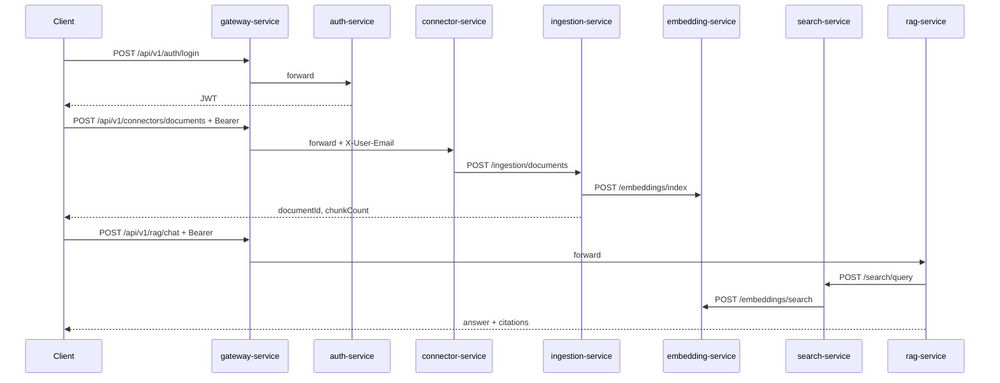

# Enterprise AI Platform

Centralized AI platform enabling employees to securely search, interact with, and automate work across enterprise knowledge sources (Confluence, Jira, SharePoint, PDFs, incident reports, internal documentation) using RAG, AI agents, and workflow automation.

**Current maturity:** **Phase 1 MVP** — JWT auth, manual document upload, ingestion/chunking, semantic search (dev embeddings), and RAG chat are implemented end-to-end. Agent, audit, multi-source connectors, and async messaging are planned next.

---

## Repository layout

```
enterprise-ai-platform/
├── gateway-service/        # API gateway, JWT validation, routing
├── auth-service/           # Login, register, JWT issuance
├── connector-service/      # Document connectors (manual MVP)
├── ingestion-service/      # Chunking and document storage
├── embedding-service/      # Vector index (JSON embeddings in Postgres)
├── search-service/         # Semantic search API
├── rag-service/            # RAG chat orchestration
├── agent-service/          # Agent workflows (scaffold)
├── audit-service/          # Audit logging (scaffold)
├── notification-service/   # Notifications (scaffold)
├── platform-common/        # Shared DTOs and API envelope
├── platform-service-parent/# Shared Maven dependencies
├── frontend/               # Web UI (placeholder)
├── observability/          # Prometheus + Grafana (local)
├── infra/                  # Postgres Docker Compose
└── docs/                   # Architecture, runbooks, analysis
```

Additional root document: [`SYSTEM_ARCHITECTURE_ANALYSIS.md`](../SYSTEM_ARCHITECTURE_ANALYSIS.md) — deep-dive for interviews and operations.

---

## MVP request flow (implemented)



All external calls use **gateway** on port **8080**. Inter-service calls use direct HTTP on localhost in development.

---

## Implemented APIs

| Method | Path | Service | Auth (via gateway) |
|--------|------|---------|-------------------|
| GET | `/api/v1/health` | All | Public |
| POST | `/api/v1/auth/login` | auth | Public |
| POST | `/api/v1/auth/register` | auth | Public |
| POST | `/api/v1/connectors/documents` | connector | Bearer JWT |
| POST | `/api/v1/ingestion/documents` | ingestion | Internal / direct |
| POST | `/api/v1/embeddings/index` | embedding | Internal / direct |
| POST | `/api/v1/embeddings/search` | embedding | Internal / direct |
| POST | `/api/v1/search/query` | search | Bearer JWT |
| POST | `/api/v1/rag/chat` | rag | Bearer JWT |

Standard response envelope:

```json
{
  "data": { },
  "timestamp": "2026-06-01T12:00:00Z"
}
```

See [`MVP_RUNBOOK.md`](MVP_RUNBOOK.md) for curl examples.

---

## Data flow (platform vision)

1. **Connect** — `connector-service` pulls or receives content (manual upload in MVP).
2. **Ingest** — `ingestion-service` normalizes, chunks, and persists documents.
3. **Embed** — `embedding-service` stores vectors for each chunk.
4. **Search** — `search-service` runs semantic retrieval.
5. **RAG** — `rag-service` retrieves context and generates grounded answers.
6. **Govern** — `auth-service` issues JWTs; `audit-service` (planned) records actions.

---

## Databases (Postgres)

| Database | Service | Tables (MVP) |
|----------|---------|----------------|
| `enterprise_ai_auth` | auth-service | `users` |
| `enterprise_ai_ingestion` | ingestion-service | `documents`, `document_chunks` |
| `enterprise_ai_embedding` | embedding-service | `chunk_embeddings` |
| `enterprise_ai_audit` | audit-service | _(schema planned)_ |

Created by `infra/init-databases.sql` when using Docker Compose.

---

## Security (MVP)

- **JWT (HS256)** issued by `auth-service`; validated at **gateway** (`spring-boot-starter-oauth2-resource-server`).
- Secret: env `JWT_SECRET` (shared by gateway and auth).
- Gateway adds **`X-User-Email`** from JWT `email` claim for downstream services.
- Dev user seeded on startup: `admin@enterprise.local` / `Enterprise123!`
- **Not yet:** enterprise OIDC/SSO, service-to-service mTLS, document-level ACL.

---

## Technology stack

| Layer | Choice |
|-------|--------|
| Runtime | Java 17 |
| Framework | Spring Boot 3.4.5 |
| Edge | Spring Cloud Gateway 2024.0.1 |
| Build | Maven multi-module |
| RDBMS | PostgreSQL 16 (local via Docker) |
| Migrations | Flyway (auth, ingestion, embedding) |

---

## Local service ports

| Service | Port |
|---------|------|
| gateway-service | 8080 |
| auth-service | 8081 |
| connector-service | 8082 |
| ingestion-service | 8083 |
| embedding-service | 8084 |
| search-service | 8085 |
| rag-service | 8086 |
| agent-service | 8087 |
| audit-service | 8088 |
| notification-service | 8089 |

**Startup order (MVP):** Postgres → auth → **embedding** → ingestion → search → connector → rag → gateway.

---

## Build and run

```bash
mvn clean install
cd infra && docker compose up -d
# Start services (see MVP_RUNBOOK.md)
mvn -pl gateway-service spring-boot:run
```

---

## Roadmap (after MVP)

| Priority | Item |
|----------|------|
| P1 | OpenAI / Azure embeddings (replace dev hash vectors) |
| P1 | Enterprise OIDC (Entra ID, Okta) |
| P2 | Confluence / SharePoint connectors |
| P2 | Kafka async ingestion pipeline |
| P2 | Audit events on query and ingest |
| P3 | Agent workflows |
| P3 | React/Next.js frontend |
| P3 | Kubernetes + Helm |
